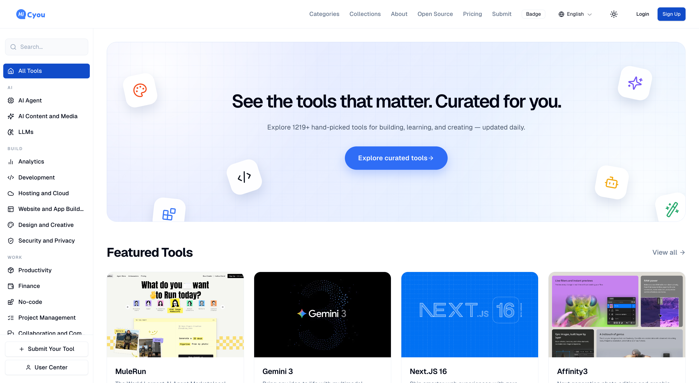

# HiCyou

[English](README.md) | [简体中文](README.zh-CN.md)

HiCyou is a self-hosted directory for products and online resources. It combines the public catalog, publisher submissions, moderation tools, translations, APIs, and scheduled operations in one Next.js application.

The public repository contains the reusable HiCyou core, database migrations, synthetic seed data, tests, and deployment examples. It does not include the production data or private deployment configuration used by [hicyou.com](https://hicyou.com).

[Website](https://hicyou.com) · [Deployment guide](docs/DEPLOYMENT.md) · [Migration from v1](docs/MIGRATING_FROM_V1.md) · [Security policy](SECURITY.md)

## Interface preview



This screenshot shows the hosted [hicyou.com](https://hicyou.com) directory. Production listings and hosted-service configuration are not included in this repository. Third-party names and marks shown in the screenshot belong to their respective owners.

## What is included

| Area              | Capabilities                                                                                                                                            |
| ----------------- | ------------------------------------------------------------------------------------------------------------------------------------------------------- |
| Directory         | Product pages, categories, tags, collections, search, related listings, responsive layouts, and light/dark themes                                       |
| Languages         | English, Simplified Chinese, Japanese, Spanish, Portuguese, German, and French routes with translated product content                                   |
| Publishing        | URL-first submissions, metadata prefill, accounts, submission status tracking, badge verification, and optional Turnstile protection                    |
| Operations        | Admin moderation, batch actions, taxonomy management, translation workflows, content-quality review, category enrichment, and automatic collections     |
| Developer API     | Bearer API tokens, OpenAPI 3.1 documentation, product search/export, keyset pagination, incremental change feeds, usage tracking, and outbound webhooks |
| Discovery         | Metadata, JSON-LD, sitemap and robots endpoints, Open Graph images, `llms.txt`, and `llms-full.txt`                                                     |
| Optional services | OpenAI-compatible content workflows, Exa search, Resend email, S3/R2-compatible object storage, OAuth, analytics, and Turnstile                         |

The application treats submitted URLs and webhook destinations as untrusted input. Outbound requests validate public DNS answers, pin the approved address for the connection, revalidate redirects, and apply response and timeout limits. Admin and cron operations enforce server-side authorization, while rate limits and bounded batch sizes reduce automated abuse.

## Technology

| Layer                | Current stack                                                                   |
| -------------------- | ------------------------------------------------------------------------------- |
| Application          | Next.js 16.3 with the App Router and React 19 Server Components                 |
| Language             | TypeScript 5.9                                                                  |
| UI                   | Tailwind CSS 3, Radix primitives, and shadcn-style local components             |
| Internationalization | next-intl 4                                                                     |
| Data                 | PostgreSQL 15+ and Drizzle ORM 0.45                                             |
| Authentication       | Better Auth 1.6 with optional GitHub and Google OAuth                           |
| Tooling              | Bun 1.4 for installs, tests, and scripts; Node.js 22+ for the standalone server |
| Deployment           | Next.js standalone output, Docker, and Docker Compose                           |

Exact dependency versions are recorded in [`package.json`](package.json) and [`bun.lock`](bun.lock).

## Run locally

You need Bun 1.4 and PostgreSQL 15 or newer.

```bash
git clone https://github.com/hicyoucom/hicyou.git
cd hicyou
bun install --frozen-lockfile
cp .env.example .env
```

Set `DATABASE_URL`, `BETTER_AUTH_SECRET`, `BETTER_AUTH_URL`, `NEXT_PUBLIC_SITE_URL`, and `ADMIN_EMAILS` in `.env`, then initialize the database:

```bash
bun run db:migrate
bun run db:seed # optional synthetic demo entry
bun run dev
```

Open <http://localhost:3000> after the server starts. Optional integrations remain disabled or degrade safely when their variables are empty.

For a container-based evaluation:

```bash
cp .env.example .env
docker compose up --build
```

Replace every `replace-me` value before exposing an instance outside your machine. Read the [deployment guide](docs/DEPLOYMENT.md) for reverse-proxy, egress-control, migration, and production-secret guidance.

## API and automation

The read-only v1 API is documented at `/api/v1/docs` and exposed as OpenAPI JSON at `/api/v1/openapi`. It includes:

- Product listing, detail, search, category, and tag endpoints
- Streaming NDJSON export
- Incremental change feeds with upserts and deletion tombstones
- Keyset cursors, rate-limit responses, and selectable translated fields

API access uses tokens created in Hi Studio. Scheduled publishing, translation, webhook delivery, log pruning, and collection generation use authenticated, bounded cron routes.

## Development checks

```bash
bun run open-source:check
bun run lint
bun run typecheck
bun test
bun run build
```

CI repeats database migrations to verify idempotence, runs unit and PostgreSQL integration tests, builds the standalone application and container, and scans source, Git history, dependencies, configuration, and the image for secrets and high-severity vulnerabilities.

## Project boundaries

The repository ships synthetic seed content only. hicyou.com production records, partner configuration, credentials, internal operating documents, deployment workflows, monitoring, backups, and private Git history remain outside this distribution.

If you are upgrading the original v1 directory, read [MIGRATING_FROM_V1.md](docs/MIGRATING_FROM_V1.md) before changing the database.

## License, brand, and contributions

HiCyou code in this distribution is licensed under [Apache-2.0](LICENSE). Code derived from 9d8's Directory project remains covered by its MIT notice, and the bundled Geist fonts use the SIL Open Font License 1.1. See [THIRD_PARTY_LICENSES.md](THIRD_PARTY_LICENSES.md), [NOTICE](NOTICE), and [OFL-1.1.txt](OFL-1.1.txt) for the complete boundaries.

The HiCyou name and logo are project marks, not part of the Apache patent or trademark grant. A "Powered by HiCyou" badge is welcome but entirely optional. See [BRAND.md](BRAND.md) for permitted brand use.

Read [CONTRIBUTING.md](CONTRIBUTING.md) before opening a pull request. Report security issues through the private process in [SECURITY.md](SECURITY.md), not a public issue.
