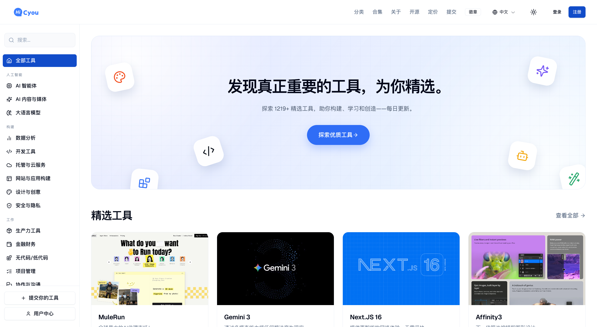

# HiCyou

[English](README.md) | 简体中文

HiCyou 是一个可自行部署的产品与网络资源目录。一个 Next.js 应用同时提供公开目录、发布者提交、内容审核、多语言、API 和定时任务。

公开仓库包含可复用的 HiCyou 核心、数据库迁移、合成示例数据、测试和部署示例，不包含 [hicyou.com](https://hicyou.com) 使用的生产数据或私有部署配置。

[官方网站](https://hicyou.com) · [部署指南](docs/DEPLOYMENT.md) · [从 v1 迁移](docs/MIGRATING_FROM_V1.md) · [安全策略](SECURITY.md)

## 界面预览



截图展示的是 [hicyou.com](https://hicyou.com) 托管版本。生产目录数据和托管服务配置不包含在本仓库中。截图中的第三方名称与标识归各自权利人所有。

## 包含内容

| 模块 | 功能 |
| --- | --- |
| 目录 | 产品详情、分类、标签、合集、搜索、相关条目、响应式布局以及浅色和深色主题 |
| 多语言 | 英语、简体中文、日语、西班牙语、葡萄牙语、德语和法语路由，以及产品内容翻译 |
| 发布 | 先填写网址的提交方式、元数据预填、账户、提交状态、徽章验证和可选 Turnstile |
| 运维 | 后台审核、批量操作、分类与标签管理、翻译、内容质量检查、分类补充和自动合集 |
| 开发者 API | Bearer Token、OpenAPI 3.1 文档、产品搜索与导出、游标分页、增量变更流、用量统计和出站 Webhook |
| 发现能力 | Metadata、JSON-LD、Sitemap、robots、Open Graph 图片、`llms.txt` 和 `llms-full.txt` |
| 可选服务 | OpenAI 兼容内容工作流、Exa 搜索、Resend 邮件、S3/R2 兼容对象存储、OAuth、统计分析和 Turnstile |

应用把提交的网址和 Webhook 目标视为不可信输入。出站请求会验证公开 DNS 解析结果，连接时固定已批准的地址，在重定向后重新验证，并限制响应大小和超时时间。后台与 Cron 操作在服务端验证权限；速率限制和受限批次用于减少自动化滥用。

## 技术栈

| 层级 | 当前选型 |
| --- | --- |
| 应用 | Next.js 16.3、App Router 和 React 19 Server Components |
| 语言 | TypeScript 5.9 |
| UI | Tailwind CSS 3、Radix Primitives 和 shadcn 风格的本地组件 |
| 国际化 | next-intl 4 |
| 数据 | PostgreSQL 15+ 和 Drizzle ORM 0.45 |
| 身份认证 | Better Auth 1.6，可选 GitHub 和 Google OAuth |
| 工具链 | Bun 1.4 用于安装、测试和脚本；Node.js 22+ 用于运行 standalone 服务 |
| 部署 | Next.js standalone 输出、Docker 和 Docker Compose |

准确的依赖版本记录在 [`package.json`](package.json) 和 [`bun.lock`](bun.lock) 中。

## 本地运行

需要 Bun 1.4 和 PostgreSQL 15 或更高版本。

```bash
git clone https://github.com/hicyoucom/hicyou.git
cd hicyou
bun install --frozen-lockfile
cp .env.example .env
```

在 `.env` 中配置 `DATABASE_URL`、`BETTER_AUTH_SECRET`、`BETTER_AUTH_URL`、`NEXT_PUBLIC_SITE_URL` 和 `ADMIN_EMAILS`，然后初始化数据库：

```bash
bun run db:migrate
bun run db:seed # 可选的合成示例条目
bun run dev
```

服务启动后打开 <http://localhost:3000>。未配置可选集成时，相关功能会保持关闭或安全降级。

也可以使用容器进行评估：

```bash
cp .env.example .env
docker compose up --build
```

在将实例开放到本机之外前，请替换所有 `replace-me` 值。反向代理、出站访问控制、数据库迁移和生产密钥的说明见[部署指南](docs/DEPLOYMENT.md)。

## API 与自动化

只读 v1 API 的文档位于 `/api/v1/docs`，OpenAPI JSON 位于 `/api/v1/openapi`。API 包含：

- 产品列表、详情、搜索、分类和标签接口
- NDJSON 流式导出
- 包含更新记录和删除墓碑的增量变更流
- 游标分页、速率限制响应和可选的翻译字段

API 使用在 Hi Studio 中创建的 Token 进行访问。定时发布、翻译、Webhook 投递、日志清理和合集生成通过需要认证且限制批量大小的 Cron 路由执行。

## 开发检查

```bash
bun run open-source:check
bun run lint
bun run typecheck
bun test
bun run build
```

CI 会重复执行数据库迁移以验证幂等性，运行单元测试和 PostgreSQL 集成测试，构建 standalone 应用与容器，并扫描源代码、Git 历史、依赖、配置和镜像中的密钥及高严重性漏洞。

## 项目边界

仓库只提供合成示例内容。hicyou.com 的生产记录、合作伙伴配置、凭据、内部运营文档、部署工作流、监控、备份和私有 Git 历史不在公开范围内。

如果从最初的 v1 目录升级，请在修改数据库前阅读[从 v1 迁移](docs/MIGRATING_FROM_V1.md)。

## 许可证、品牌与贡献

本发行版中的 HiCyou 代码使用 [Apache-2.0](LICENSE) 许可证。源自 9d8 Directory 项目的代码继续保留其 MIT 声明，仓库内的 Geist 字体使用 SIL Open Font License 1.1。完整的授权边界见 [THIRD_PARTY_LICENSES.md](THIRD_PARTY_LICENSES.md)、[NOTICE](NOTICE) 和 [OFL-1.1.txt](OFL-1.1.txt)。

HiCyou 名称与 Logo 属于项目标识，不在 Apache 的专利或商标授权范围内。欢迎使用“Powered by HiCyou”徽章，但这不是强制要求。可接受的品牌使用方式见 [BRAND.md](BRAND.md)。

提交 Pull Request 前请阅读 [CONTRIBUTING.md](CONTRIBUTING.md)。安全问题请按照 [SECURITY.md](SECURITY.md) 中的私密报告方式提交，不要创建公开 Issue。
